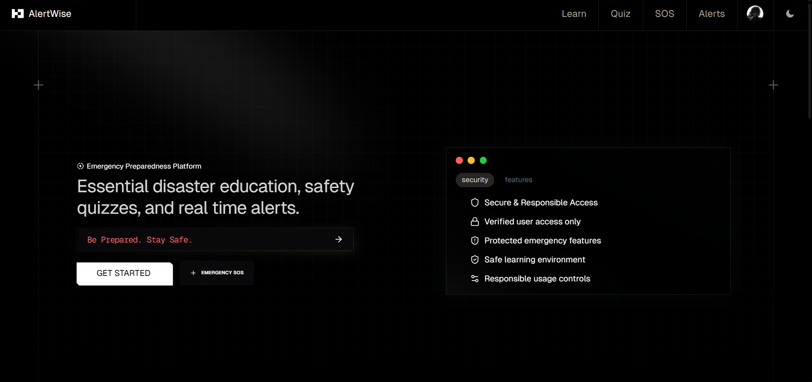
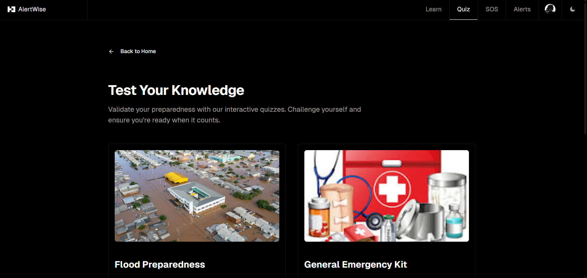

# AlertWise | Interactive Learning Hub

Experience a high-performance, premium web interface designed to make disaster preparedness education intuitive and engaging.

---

## 📖 Features Overview

### 1. Disaster Learning Center

Explore detailed modules on natural disasters, including earthquakes, floods, and wildfires, all rendered with a beautiful, minimalist aesthetic.

### 2. Knowledge Assessments

Validate your learning with our specialized quiz engine. Designed for maximum focus and legibility to ensure key safety tips are remembered.

---

## ⚡ Technical Foundation

- **Modern React**: Leveraging **React 19** and **Next.js 16** for a lightning-fast experience.
- **Custom Design**: A bespoke dark-themed UI built from the ground up with **Tailwind CSS 4**.
- **Interactive Content**: Dynamic learning paths powered by **Fumadocs** and **Framer Motion**.

---

*Empowering communities through accessible safety education.*
